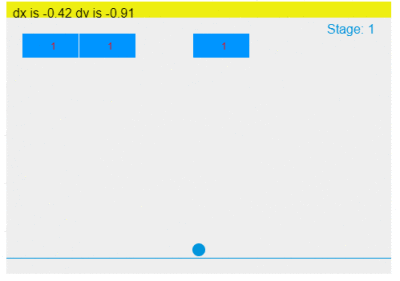
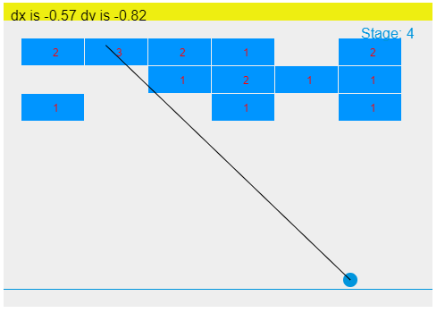

# AtariSwipeBreak
make swipe break in javascript

#progress 1 - 다깨면 스테이지를 넘어가는 방식

#progress 2 - 한칸씩 블록이 내려가는 스와이프 블록깨기 방식대로 됨 ( 공 개수 정의하는게 중요)

#progress 3 - 발사 가이드라인 만들기 벽돌에 닿으면 없어져야되는데 실패하고 
		가이드라인과 조금 다르게  발사가된다 190618

#progress 4 - 발사 가이드라인 완성( 벽돌에 닿으면 없어지고 같게 발사하게함)

